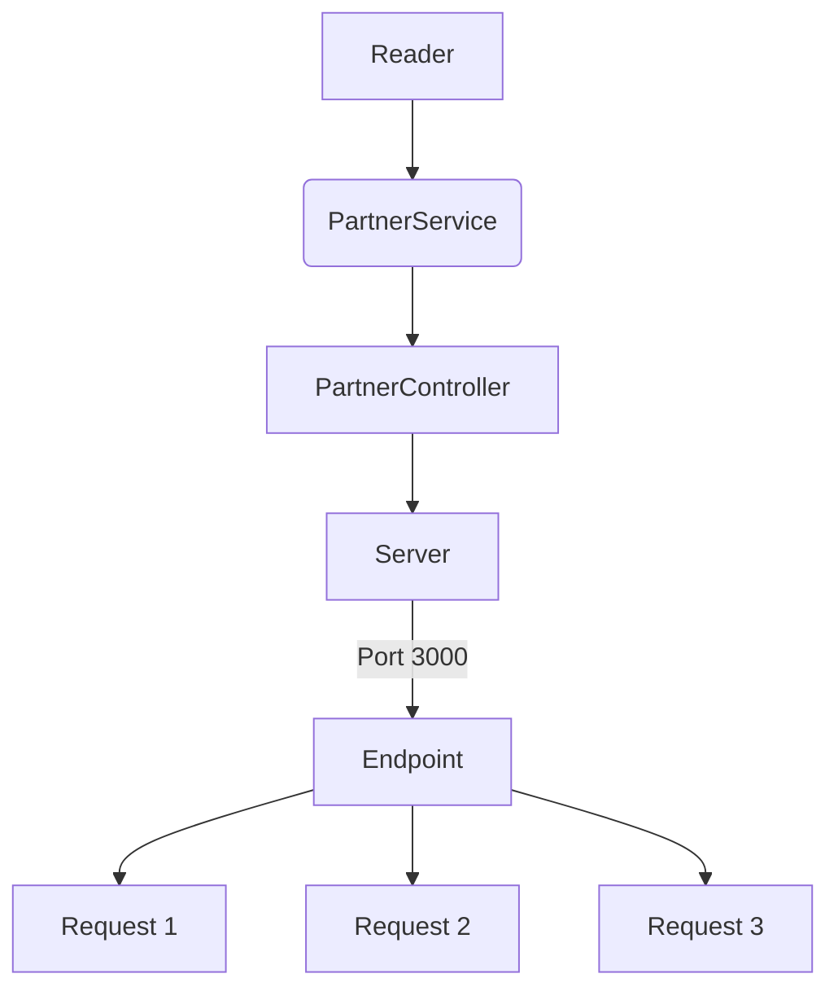
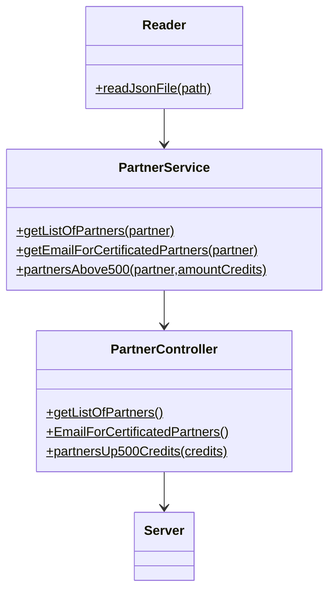

# Code-Challenge
___

Api que nos permite hacer consultas de datos por medio de un `JSON` de los partners proporcionado por parte de VisualPartnership, los requerimientos son los siguientes:

* Habilitar un endpoint para la consulta de todos los partners y sus datos completos
* Habilitar un endpoint para obtener los emails de los partners  que tengan una certificación
* Habilitar un endpoint para obtener los partners con mas de 500 creditos
___
## Requisitos

Nececitas tener`node` y`npm`. 
Revisar la [pagina de node](https://nodejs.org/es/download/) para ver el procedimiento dependiendo de tu SO.

___

## Diagramas

Funcionamiento del proyecto.

## Diseño de las clases
Estructura de las clases en el proyecto.

## Endpoints

| Endpoint | Request |
|---|---|
| `localhost:3000/v1/partner/` | `localhost:3000/v1/partner` | 
| `localhost:3000/v1/partner/emails` | `localhost:3000/v1/partner` | 
| `localhost:3000/v1/partner/student/:credits` | `localhost:3000/v1/partner/student/500` | 

## Response
Endpoint `localhost:3000/v1/partner`

___
Endpoint `localhost:3000/v1/partner`

___
Endpoint `localhost:3000/v1/partner/student/500`

## Postman

Pudes usar postman para consultar los endpoints.

https://user-images.githubusercontent.com/94636815/166490034-ac9cd206-87ee-44ff-a8c0-026184954937.mp4

## Tecnologías

* JavaScript
* Jest
* Github Actions
* ESLint
* Express
* Postman

