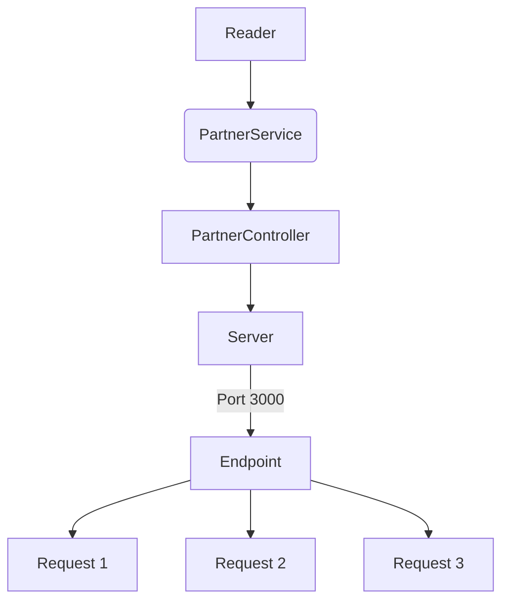
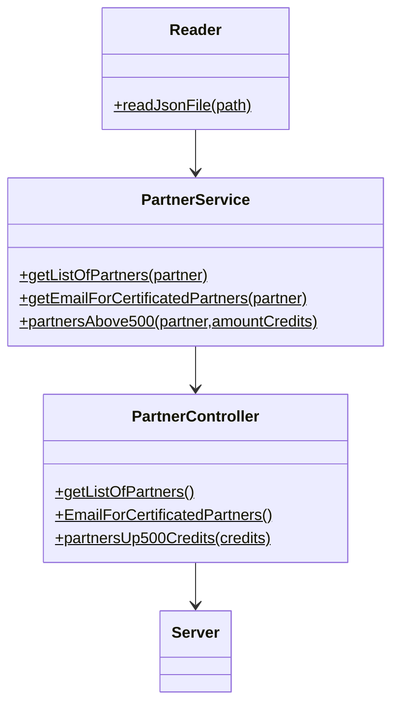

# Code-Challenge
___

Api que nos permite hacer consultas de datos por medio de un `JSON` de los partners proporcionado por parte de VisualPartnership, los requerimientos son los siguientes:

* Habilitar un endpoint para la consulta de todos los partners y sus datos completos
* Habilitar un endpoint para obtener los emails de los partners  que tengan una certificación
* Habilitar un endpoint para obtener los partners con mas de 500 creditos
___
## Requisitos

Nececitas tener`node` y`npm`. 
Revisar la [pagina de node](https://nodejs.org/es/download/) para ver el procedimiento dependiendo de tu SO.

___

## Diagramas

Funcionamiento del proyecto.

## Diseño de las clases
Estructura de las clases en el proyecto.

